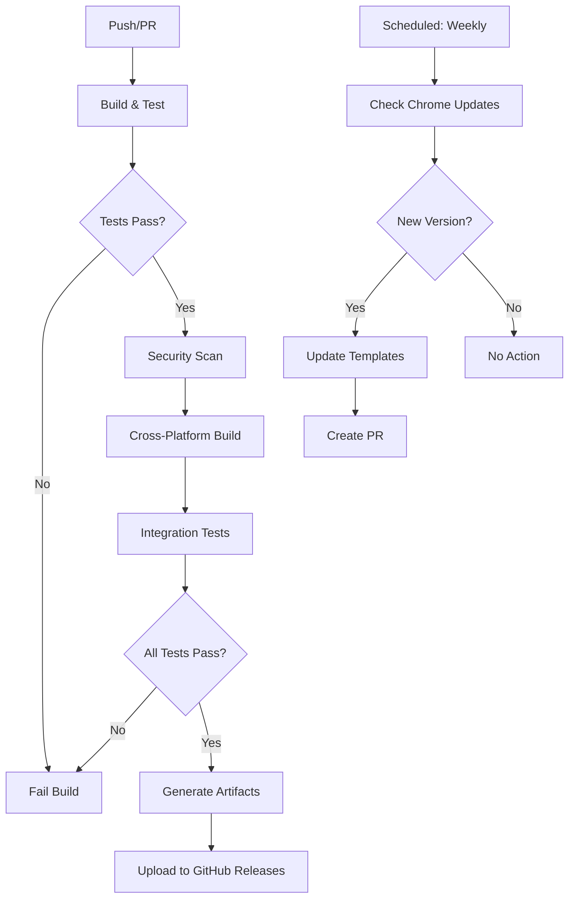

# Design Document — Raven Betanet 1.1 Dual Bounty Implementation

## Overview

This project implements two CLI tools in Go within a monorepo structure, sharing common infrastructure while maintaining clear separation of concerns. The design leverages established Go patterns, proven libraries, and modern CI/CD practices to deliver robust, maintainable tools for Raven Betanet 1.1 compliance checking and Chrome uTLS template generation.

## Architecture

### High-Level Architecture

```
┌─────────────────────────────────────────────────────────────┐
│                    Dual CLI Project                         │
├─────────────────────────────────────────────────────────────┤
│  ┌─────────────────┐    ┌─────────────────────────────────┐ │
│  │  raven-linter   │    │    chrome-utls-gen              │ │
│  │                 │    │                                 │ │
│  │ • check cmd     │    │ • generate cmd                  │ │
│  │ • 11 compliance │    │ • ja3-test cmd                  │ │
│  │   checks        │    │ • update cmd                    │ │
│  │ • SBOM gen      │    │ • auto-refresh                  │ │
│  └─────────────────┘    └─────────────────────────────────┘ │
├─────────────────────────────────────────────────────────────┤
│                 Shared Infrastructure                       │
│  ┌─────────────┐ ┌─────────────┐ ┌─────────────┐ ┌────────┐│
│  │   Logging   │ │   Config    │ │    HTTP     │ │  CLI   ││
│  │   Utils     │ │   Loading   │ │   Client    │ │ Framework││
│  └─────────────┘ └─────────────┘ └─────────────┘ └────────┘│
└─────────────────────────────────────────────────────────────┘
```

### Project Structure

```
/
├── cmd/
│   ├── raven-linter/           # CLI entrypoint for spec linter
│   │   └── main.go
│   └── chrome-utls-gen/        # CLI entrypoint for uTLS generator
│       └── main.go
├── internal/
│   ├── checks/                 # 11 compliance check implementations
│   │   ├── check_interface.go
│   │   ├── binary_analysis.go
│   │   ├── crypto_validation.go
│   │   └── ...
│   ├── sbom/                   # SBOM generation module
│   │   ├── generator.go
│   │   ├── cyclonedx.go
│   │   └── spdx.go
│   ├── tlsgen/                 # Chrome handshake generator + JA3
│   │   ├── chrome_client.go
│   │   ├── ja3_calculator.go
│   │   ├── handshake_gen.go
│   │   └── updater.go
│   ├── utils/                  # Shared utilities
│   │   ├── logging.go
│   │   ├── config.go
│   │   ├── http_client.go
│   │   └── version.go
│   └── cli/                    # Shared CLI components
│       ├── root.go
│       └── common_flags.go
├── tests/                      # Integration test data
│   ├── golden/
│   │   ├── chrome_handshakes/
│   │   ├── sbom_outputs/
│   │   └── compliance_results/
│   ├── fixtures/
│   │   ├── sample_binaries/
│   │   └── test_configs/
│   └── integration/
├── .github/
│   └── workflows/
│       ├── spec-linter.yml
│       ├── chrome-utls-gen.yml
│       └── auto-refresh.yml
├── go.mod
├── go.sum
├── Makefile
└── README.md
```

## Components and Interfaces

### 1. Spec-Compliance Linter Components

#### Check Interface
```go
type ComplianceCheck interface {
    ID() string
    Description() string
    Execute(binaryPath string) CheckResult
}

type CheckResult struct {
    ID          string `json:"check_id"`
    Description string `json:"description"`
    Status      string `json:"status"` // "pass" | "fail"
    Details     string `json:"details"`
    Metadata    map[string]interface{} `json:"metadata,omitempty"`
}
```

#### SBOM Generator Interface
```go
type SBOMGenerator interface {
    Generate(binaryPath string, format SBOMFormat) (*SBOM, error)
    WriteToFile(sbom *SBOM, outputPath string) error
}

type SBOMFormat int
const (
    CycloneDX SBOMFormat = iota
    SPDX
)
```

### 2. Chrome uTLS Generator Components

#### TLS Client Interface
```go
type ChromeTLSClient interface {
    GenerateClientHello(version ChromeVersion) ([]byte, error)
    GetJA3Fingerprint(clientHello []byte) (string, error)
    TestConnection(target string, clientHello []byte) (*ConnectionResult, error)
}

type ChromeVersion struct {
    Major    int    `json:"major"`
    Minor    int    `json:"minor"`
    Build    int    `json:"build"`
    Patch    int    `json:"patch"`
    Channel  string `json:"channel"`
    Platform string `json:"platform"`
}
```

#### Chrome Version Updater
```go
type ChromeUpdater interface {
    FetchLatestVersion() (*ChromeVersion, error)
    UpdateTemplates(version *ChromeVersion) error
    GetCurrentVersion() (*ChromeVersion, error)
}
```

### 3. Shared Infrastructure Components

#### Configuration Management
```go
type Config struct {
    LogLevel    string            `yaml:"log_level" env:"LOG_LEVEL"`
    OutputDir   string            `yaml:"output_dir" env:"OUTPUT_DIR"`
    HTTPTimeout time.Duration     `yaml:"http_timeout" env:"HTTP_TIMEOUT"`
    Chrome      ChromeConfig      `yaml:"chrome"`
    Linter      LinterConfig      `yaml:"linter"`
}

type ChromeConfig struct {
    APIEndpoint     string `yaml:"api_endpoint"`
    RefreshInterval string `yaml:"refresh_interval"`
    TargetVersions  []string `yaml:"target_versions"` // ["stable", "stable-2"]
}

type LinterConfig struct {
    SBOMFormat      string   `yaml:"sbom_format"`
    EnabledChecks   []string `yaml:"enabled_checks"`
    OutputFormat    string   `yaml:"output_format"`
}
```

#### HTTP Client with Retry Logic
```go
type HTTPClient struct {
    client      *http.Client
    retryCount  int
    backoffFunc func(int) time.Duration
}

func (h *HTTPClient) GetWithRetry(url string) (*http.Response, error)
func (h *HTTPClient) PostWithRetry(url string, body io.Reader) (*http.Response, error)
```

## Data Models

### 1. Compliance Check Results
```go
type ComplianceReport struct {
    Timestamp    time.Time     `json:"timestamp"`
    BinaryPath   string        `json:"binary_path"`
    BinaryHash   string        `json:"binary_hash"`
    TotalChecks  int           `json:"total_checks"`
    PassedChecks int           `json:"passed_checks"`
    FailedChecks int           `json:"failed_checks"`
    Results      []CheckResult `json:"results"`
    SBOMPath     string        `json:"sbom_path,omitempty"`
}
```

### 2. Chrome TLS Data Models
```go
type ClientHelloTemplate struct {
    Version     ChromeVersion `json:"version"`
    Bytes       []byte        `json:"bytes"`
    JA3Hash     string        `json:"ja3_hash"`
    JA3String   string        `json:"ja3_string"`
    GeneratedAt time.Time     `json:"generated_at"`
}

type ConnectionResult struct {
    Target          string        `json:"target"`
    Connected       bool          `json:"connected"`
    JA3Fingerprint  string        `json:"ja3_fingerprint"`
    TLSVersion      string        `json:"tls_version"`
    CipherSuite     string        `json:"cipher_suite"`
    ResponseTime    time.Duration `json:"response_time"`
    Error           string        `json:"error,omitempty"`
}
```

### 3. SBOM Data Models
```go
type SBOM struct {
    Format      SBOMFormat    `json:"format"`
    Version     string        `json:"version"`
    Components  []Component   `json:"components"`
    Metadata    SBOMMetadata  `json:"metadata"`
    GeneratedAt time.Time     `json:"generated_at"`
}

type Component struct {
    Type         string            `json:"type"`
    Name         string            `json:"name"`
    Version      string            `json:"version"`
    Hashes       map[string]string `json:"hashes"`
    Licenses     []string          `json:"licenses"`
    Dependencies []string          `json:"dependencies"`
}
```

## Error Handling

### Error Types and Strategies

1. **Validation Errors**: Input validation failures (invalid binary path, malformed config)
   - Return immediately with clear error message
   - Exit code 2 for CLI tools

2. **Network Errors**: HTTP requests, Chrome API calls
   - Implement exponential backoff retry (3 attempts)
   - Timeout after 30 seconds per request
   - Graceful degradation where possible

3. **File System Errors**: Binary analysis, SBOM generation
   - Check permissions before operations
   - Provide actionable error messages
   - Clean up partial files on failure

4. **TLS/Crypto Errors**: Handshake generation, JA3 calculation
   - Log detailed error context for debugging
   - Fallback to previous known-good templates
   - Clear error messages for end users

### Error Response Format
```go
type CLIError struct {
    Code    int    `json:"code"`
    Message string `json:"message"`
    Details string `json:"details,omitempty"`
    Context map[string]interface{} `json:"context,omitempty"`
}

func (e *CLIError) Error() string
func (e *CLIError) ExitCode() int
```

## Testing Strategy

### 1. Unit Testing
- **Coverage Target**: 85% minimum
- **Test Structure**: Table-driven tests for each compliance check
- **Mocking**: HTTP clients, file system operations, external dependencies
- **Golden Files**: Expected outputs for deterministic results

### 2. Integration Testing
- **End-to-End CLI Testing**: Full command execution with real binaries
- **Network Integration**: Real Chrome API calls (with fallback to mocked responses)
- **File System Integration**: Actual SBOM generation and validation
- **Cross-Platform Testing**: Linux, macOS, Windows in CI

### 3. Performance Testing
- **Binary Analysis**: Test with large binaries (>100MB)
- **Concurrent Operations**: Multiple compliance checks in parallel
- **Memory Usage**: Profile memory consumption during SBOM generation
- **Network Timeouts**: Verify retry logic under network stress

### 4. Security Testing
- **Input Validation**: Malicious binary inputs, path traversal attempts
- **Dependency Scanning**: Regular security audits of Go dependencies
- **Secrets Handling**: Ensure no sensitive data in logs or outputs
- **TLS Security**: Verify generated handshakes don't leak information

## Implementation Dependencies

### Core Go Libraries
- **CLI Framework**: `github.com/spf13/cobra` - Mature, well-documented CLI framework
- **Configuration**: `github.com/spf13/viper` - Configuration management with multiple sources
- **Logging**: `github.com/sirupsen/logrus` - Structured logging with multiple outputs
- **HTTP Client**: `net/http` with custom retry wrapper
- **JSON/YAML**: Standard library `encoding/json`, `gopkg.in/yaml.v3`

### Specialized Libraries
- **uTLS**: `github.com/refraction-networking/utls` - Chrome TLS fingerprint replication
- **JA3**: `github.com/salesforce/ja3` - JA3 fingerprint calculation
- **SBOM Generation**: 
  - `github.com/CycloneDX/cyclonedx-go` - CycloneDX format support
  - `github.com/spdx/tools-golang` - SPDX format support
- **Binary Analysis**: `debug/elf`, `debug/pe`, `debug/macho` - Standard library binary parsers

### Development Tools
- **Testing**: `github.com/stretchr/testify` - Enhanced testing assertions
- **Mocking**: `github.com/golang/mock` - Interface mocking for tests
- **Linting**: `golangci-lint` - Comprehensive Go linting
- **Build**: `goreleaser` - Cross-platform binary building and releasing

## Deployment and Distribution

### Build Process
1. **Cross-Compilation**: Build for Linux, macOS, Windows (amd64, arm64)
2. **Version Embedding**: Inject version, commit hash, build date via ldflags
3. **Binary Optimization**: Strip debug symbols, compress with UPX
4. **Checksums**: Generate SHA256 checksums for all artifacts

### Release Strategy
1. **GitHub Releases**: Automated releases via GitHub Actions
2. **Package Managers**: 
   - Homebrew formula for macOS/Linux
   - Chocolatey package for Windows
   - Optional: apt/yum repositories
3. **Container Images**: Docker images for CI/CD integration
4. **Update Mechanism**: Built-in update checker with GitHub Releases API

### CI/CD Pipeline Architecture


This design provides a solid foundation for implementing both CLI tools with shared infrastructure, comprehensive testing, and robust deployment processes.